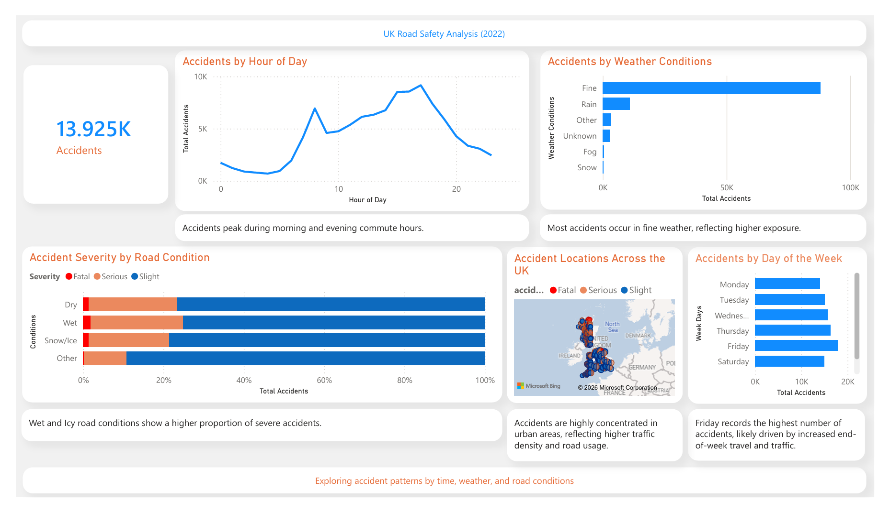

## Project Structure

- processed_data: cleaned dataset  
- scripts: data processing script  
- images: dashboard preview  

# UK Road Safety Analysis (2022)

This project analyses UK road accident data to identify patterns in accident frequency, severity, and contributing factors such as time, weather, and road conditions.

## Dashboard Preview

## Objectives

- Identify when accidents are most frequent  
- Analyse how weather and road conditions impact accidents  
- Understand factors contributing to accident severity  
- Visualise the geographical distribution of accidents  

## Tools Used

- Python (pandas) for data cleaning  
- SQL for querying and analysis  
- Power BI for data visualisation  

## Process

1. Data cleaning and transformation using Python  
2. Data validation and querying using SQL  
3. Dashboard creation in Power BI  

## Key Insights

- Accidents peak during morning and evening commuting hours  
- Friday records the highest number of accidents  
- Wet and icy road conditions show a higher proportion of severe accidents  
- Most accidents occur in fine weather, reflecting higher exposure  
- Accidents are concentrated in urban areas  

## Dataset

UK Road Safety Data (STATS19, 2022)

## How to Use

Open the Power BI file (.pbix) to explore the interactive dashboard.
